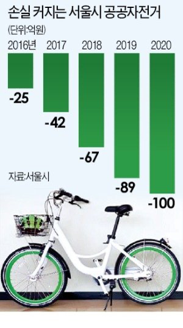

# Proved the correlation between data and bicycle demand and recommend the day for fixing	
MATLAB team project | August - December 2021 

## Why we started this project
Since 2017, the project has renewed its deficit every year. 
As the number of bicycles in operation increases, as well as the cost of maintaining and managing previously purchased bicycles and rental stations, Seoul public bicycle is running into a deficit. 
https://www.newstomato.com/readNewspaper.aspx?no=1005537 
 
 
**We would like to propose ideas that can improve the deficit factors of these businesses in order to help them turn profitable.** 

## What we do?
* Used Seoul 3-year data (Traffic & Bus & Population & Subway) 
* Data standardization and visualization by district 
* Used Deep Learning Toolbox in MATLAB  
* Proved the correlation between subway and bicycle demand 
* Proved the correlation between population and bicycle demand 

## How we do project
You can see the details in "matlab_presentation.ppt" 
https://docs.google.com/presentation/d/1tWX7YK_52nd0zhGt08Tpxzvmq9HnFx1C/edit?usp=share_link&ouid=109045554416368886490&rtpof=true&sd=true
